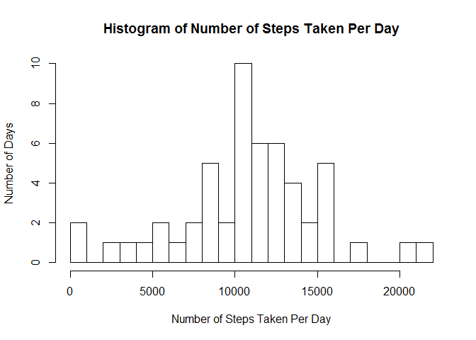
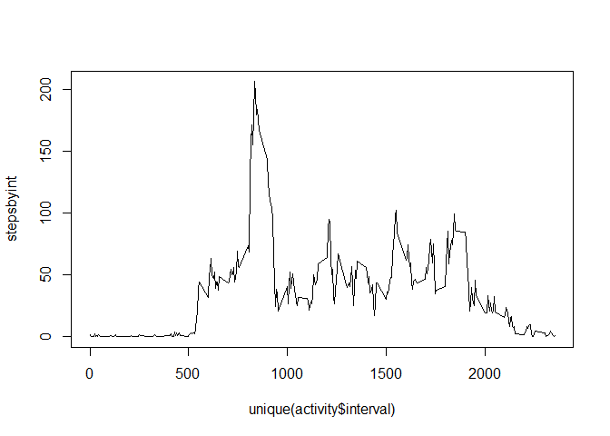
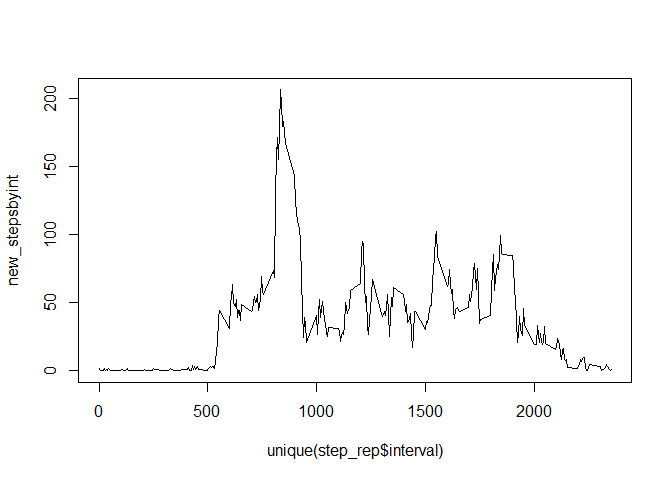
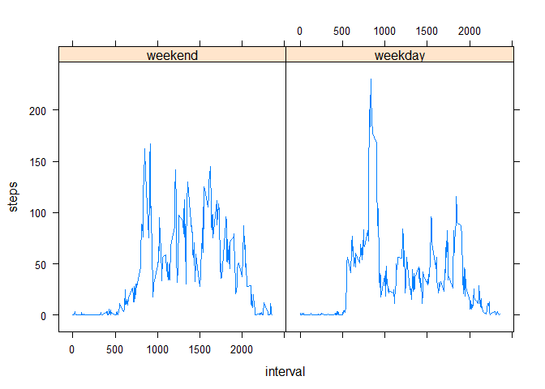

# Reproducible Research: Peer Assessment 1
## Introduction

This is a report on the activity of a research subject over a period of , measured by the number of steps taken in five-minute intervals. It investigates the diurnal variation in steps and the the difference between the activity on weekdays and the activity on weekends.


## Loading and preprocessing the data

The data are available on the internet at:

https://d396qusza40orc.cloudfront.net/repdata%2Fdata%2Factivity.zip

Firstly, we extrat the data from a .zip file that has already been downloaded and read it by running the following script:


```r
{
  #get_activity_data.R - R script to obtain 
  #walking activity data.
  
  unzip("repdata_data_activity.zip")
  
  activity<-read.csv("activity.csv")
  }
```
## What is mean total number of steps taken per day?

#

Below is a histogram showing the number of days on which the subject walked a number of steps within a given range, each range being 1000.The R code used to produce the histogram appears before the histogram.


```r
{
stepsaday<-tapply(activity$steps, activity$date, sum)

hist(stepsaday,breaks=22,xlab="Number of Steps Taken Per Day", ylab="Number of Days",main="Histogram of Number of Steps Taken Per Day")
}
```

\

The mean number of steps per day is 

```r
summary(stepsaday)[4]
```

```
##  Mean 
## 10770
```
and the median number of steps per day  is

```r
{
summary(stepsaday)[3]
}
```

```
## Median 
##  10760
```


## What is the average daily activity pattern?

Below is a time series plot of the average number of steps taken for each 5 minute time interval during the day. It is preceded by the R code that generated the plot.


```r
{
notNA<-which(activity$steps>=0)
activity_notnull<-activity[notNA,]
stepsbyint<-tapply(activity_notnull$steps, activity_notnull$interval, mean)
plot(unique(activity$interval), stepsbyint,type="l")
}
```

\

From this graph it can be seen that the subject is usually most active at about 9am each and walks very little between about 11pm and 5am.

The time interval with the most steps can be found by using this R code:

```r
{
  maxsteps<-which(stepsbyint==max(stepsbyint))
  stepstable<-cbind(unique(activity_notnull$interval), as.vector(stepsbyint))
  stepstable[maxsteps,1]
  }
```

```
## [1] 835
```
The time interval with the most steps is 8:35 to 8:40 am.

The number of records with no value for steps taken is


```r
{length(which(activity$steps==FALSE))}
```

```
## [1] 11014
```

That is 11014.

## Imputing missing values

We can fill in the missing data by using the mean for a given time interval rounded to the nearest whole step.


```r
{
  fillsteps<-round(stepstable[,2])
  stepfills<-data.frame(cbind(stepstable,fillsteps))
  colnames(stepfills)<-c("interval","avsteps","fillsteps")
  step_rep<-merge(activity, stepfills, by.x="interval", by.y="interval")
  new_steps<-numeric(0)
  for (j in 1:length(step_rep$steps))
    {
    new_steps[j]<-ifelse(is.na(step_rep$steps[j]),step_rep$fillsteps[j], step_rep$steps[j])
    }
  step_rep$steps<-new_steps
  }
```

Now we can apply this set of results to the same treatment as before to see what effect imputing missing values will have.

The R code for finding the number of steps taken per day and plotting a histogram of same is:

```r
{
new_stepsaday<-tapply(step_rep$steps, step_rep$date, sum)

hist(new_stepsaday,breaks=22,xlab="Number of Steps Taken Per Day", ylab="Number of Days",main="Histogram of Number of Steps Taken Per Day\n (Missing Values Imputed",)
}
```

\


The mean number of steps per day is 

```r
summary(new_stepsaday)[4]
```

```
##  Mean 
## 10770
```
and the median number of steps per day  is

```r
{
summary(new_stepsaday)[3]
}
```

```
## Median 
##  10760
```

The code for finding the average number of steps for each time interval and plotting them  is:


```r
{
new_stepsbyint<-tapply(step_rep$steps, step_rep$interval, mean)
  plot(unique(step_rep$interval), new_stepsbyint,type="l")
}
```

\
The daily pattern of steps looks much the same as before.

The time interval with the most steps can be found by using this R code:

```r
{
  maxsteps<-which(new_stepsbyint==max(new_stepsbyint))
  stepstable<-cbind(unique(step_rep$interval), as.vector(new_stepsbyint))
  stepstable[maxsteps,1]
  }
```

```
## [1] 835
```
The time interval with the most steps is 8:35 to 8:40 am, which is the same interval as before.

## Are there differences in activity patterns between weekdays and weekends?

To determine the differences in activity patterns between weekends and weekdays we can add a column of factors (weekday or weekend) to the data frame containing the imputed data, and then produce a dataset each for weekdays and weekends, combine the datasets into to one and plot the activity on weekdends and weekdays as follows:


```r
{
  weekend_day<-ifelse(weekdays(as.Date(step_rep$date))!="Saturday"&(weekdays(as.Date(step_rep$date))!="Sunday"),"weekday","weekend")
#Add to step_rep dataset as a weekend or #weekday column. 
  step_rep$weekend<-weekend_day
#Create a data frame for weekdays.
  weekday_steps<-step_rep[step_rep$weekend=="weekday",]
    weekend_steps<-step_rep[step_rep$weekend=="weekend",]

}
```

We can now find plot the average number of steps for each time interval in the weekends and on weekdays separately as follows:


```r
{
# Find average number of steps by time interval # for weekends.
  weekend_stepsbyint<-tapply(weekend_steps$steps, weekend_steps$interval, mean)
  
#Find average number of steps by time interval 
#on weekdays.

  weekday_stepsbyint<-tapply(weekday_steps$steps, weekday_steps$interval, mean)

# Now create data frames for weekend and 
# weekday five-minute intervals and combine 
# into a data frame for plotting.

  weekend_ints<-data.frame(interval=unique(weekend_steps$interval), steps=weekend_stepsbyint,weekend_weekday=rep("weekend",length(weekend_stepsbyint)))

  weekday_ints<-data.frame(interval=unique(weekday_steps$interval), steps=weekday_stepsbyint,weekend_weekday=rep("weekday",length(weekday_stepsbyint)))

  step_ints<-rbind(weekend_ints, weekday_ints)

  library(lattice)
  p<-xyplot(steps ~ interval|weekend_weekday, data=step_ints, layout=c(2,1),type="l")

  print(p)
}
```

\

The plots show that during the weekend the number of steps the subject takes is more evenly distributed over the daytime than in the week where the subject usually takes a peak number of steps at around 8:35am to 8:40am.
